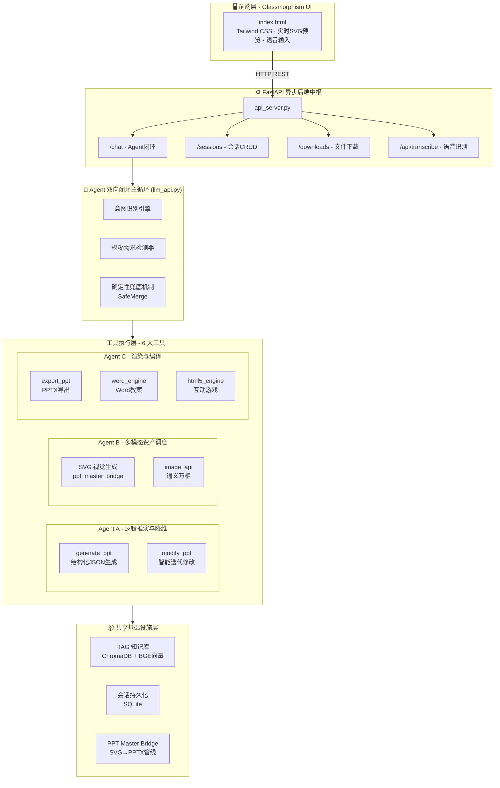

# 🧠 AI 教学智能体 — 智能备课全自动流水线

> 基于多 Agent 协同与 RAG 架构的教学内容创作引擎

**一句话描述：** 教师输入一个主题 → 系统自动完成 RAG 知识检索 → 长链推理拆解 → 多模态视觉渲染 → 输出生产级 PPT / Word 教案 / HTML5 互动游戏，全程 3 分钟内完成。

---

## 📌 解决的核心痛点

在教育和知识工程场景中，将非结构化的长文本（如教案、技术文档）转化为具备强逻辑性、图文并茂的结构化展示件（如 PPT），往往耗费极高的人力成本。市面上的通用工具大多停留在基础的"文本摘要"层面，存在以下三大根本缺陷：

| 痛点 | 现有方案的不足 | 本项目的解决方式 |
|------|-------------|--------------|
| 逻辑深度不足 | 仅做表面文字提炼，缺乏领域逻辑推演 | DeepSeek-R1 思考链模型执行深度 CoT 长链推理 |
| 幻觉问题严重 | 生成内容缺乏事实依据，容易"编造" | RAG 架构实时检索本地知识库，抑制模型幻觉 |
| 多模态断裂 | 无法自动实现文本与视觉资源的语义对齐 | 多 Agent 协同管线，自动化端到端视觉渲染 |

本项目通过构建多智能体协同管线，解决从"原始知识数据 → 结构化视觉资产"的自动化转化难题，将原本需要 4-6 小时的"教案 + 课件 + 互动设计"完整流程压缩至 3 分钟以内，效率提升超过 100 倍。

---

## 🏗️ 系统架构

### 总体架构图



### 核心逻辑流与多 Agent 协作

该项目的底层逻辑跳出了单一的自然语言生成范畴，侧重于整体的机器学习管线编排与系统工程落地。核心流转机制如下：

---

### 🔍 知识增强与检索 (RAG Logic)

在数据输入阶段，系统通过 `knowledge_base.py` 对非结构化原始数据（PDF / Word 文档）进行向量化处理（基于 `BAAI/bge-small-zh-v1.5` 深度语义模型）。在生成特定深度的内容节点时，触发 RAG 模块，从预构建的 ChromaDB 本地向量数据库中实时召回强相关案例或背景知识，有效抑制了模型的幻觉，确保生成内容的严谨性与技术准确度。


---

### 🤖 多智能体协同编排 (Multi-Agent Orchestration)

整个生成流水线被解耦为三个主控 Agent，它们各司其职并共享上下文状态：

#### Agent A — 逻辑推演与降维 (llm_api.py)

基于 DeepSeek-Reasoner (R1) 思考链模型底座，执行核心的长链推理（Chain of Thought）。它并非简单总结，而是按照预设的认知逻辑树（如"引入 → 核心概念剖析 → 案例演绎"），将长文本拆解为标准化的 JSON 结构树（Mini Design Spec）。系统通过 Few-Shot 提示词工程，实现了：

- 高精密度的结构化输出（包含 `topic`、`key_points`、`layout`、`icon_name` 四维描述）
- 四种文学专属配色方案的智能匹配（古典水墨 / 现代文学 / 复古手稿 / 竹林书院）
- 复杂指令遵循与逻辑规划能力的深度验证

#### Agent B — 多模态资产调度 (ppt_master_bridge.py + image_api.py)

接收结构化数据后，该 Agent 负责多模态对齐。核心创新点：

- 通过 LLM 直接生成高质量 SVG 代码（替代传统硬编码模板），实现了像素级精美的古典中国风 / 现代极简风视觉渲染
- 四套完整的 SVG 视觉设计体系（各含配色、字体、装饰元素、布局规范）
- 异步调用通义万相 API 获取精准匹配的图像资源
- 备用模板自动降级机制（当 LLM 返回异常时无缝切换）

#### Agent C — 渲染与编译 (ppt_engine_v2.py + word_engine.py + html5_engine.py)

承担系统的 Backend 引擎角色，三套独立的生产级导出管线：

| 引擎 | 输入 | 输出 | 技术栈 |
|------|------|------|--------|
| PPT Master Engine | JSON + SVG | .pptx 文件 | python-pptx + SVG→DrawingML |
| Word Engine | 结构化教案 JSON | .docx 文件 | python-docx + 专业排版 |
| HTML5 Engine | 知识点主题 | 可运行 .html 文件 | 纯前端单文件应用 |

---

## ✨ 核心功能

### 1. 📝 智能 PPT 课件生成

- 输入主题 → 自动生成包含封面、内容页的完整课件
- 支持四种美学风格一键切换
- 实时 SVG 可视化预览（无需导出即可预览效果）
- 多轮对话迭代修改（增删页面、调整内容、更换风格）

### 2. 📄 Word 教案文档生成

- 自动生成五大教学模块：教学目标、教学过程、教学方法、课堂活动设计、课后作业
- 专业排版（宋体/黑体、分级标题、缩进、行距）
- 一键下载 .docx 文件

### 3. 🎮 HTML5 互动游戏生成

- 根据知识点自动生成可在浏览器运行的互动小游戏
- 支持：知识问答、卡片配对、拖拽分类、填空闯关、动画演示
- 单文件自包含，零依赖，双击即可运行

### 4. 📚 RAG 知识库增强

- 支持上传 PDF / Word 参考资料
- 自动分块 → 向量化 → 入库
- 生成时自动检索相关知识片段，抑制幻觉

### 5. 🎙️ 语音输入

- 集成硅基流动 SenseVoiceSmall 语音识别模型
- 实时语音转文字，录音脉冲动画反馈

### 6. 💬 多会话管理

- SQLite 持久化存储
- 会话历史、PPT 数据自动保存与恢复
- 支持创建、切换、删除会话

---

## 🔧 技术细节

### 确定性状态机反馈循环

在修改迭代场景下，系统并不完全依赖 LLM 的随机性输出，而是结合了意图识别算法与代码级操作兜底：

```python
# 意图检测 → 确定性操作直接执行（0 误差）
if intent in ['delete', 'reorder']:
    # 彻底绕过大模型，纯代码极速执行
    final_slides = _safe_execute_intent(original_slides, intent, feedback)

# 模型输出异常时，智能合并兜底
final_slides = _safe_merge_slides(original, new_data, intent, feedback)
```

- 删除/调序操作：代码级精确执行，响应时间 < 100ms
- 新增/修改操作：LLM 生成 + 代码兜底双保险
- 模糊需求检测：自动识别过于笼统的请求，主动追问细节

### Token 优化策略

- 修改时自动清洗 SVG 冗余字段（`preview_svg`），防止占用上下文窗口
- 历史消息滑动窗口（最近 20 条），平衡记忆深度与 Token 消耗
- DeepSeek-Reasoner 参数适配（自动禁用不支持的 temperature/top_p）

### 多引擎降级链

```
PPT 导出优先级:
  ppt-master SVG→DrawingML (原生矢量)
    → ppt_engine_v2 (python-pptx 备用)
    → fallback SVG 模板 (保底)
```

---

## 🎨 四大视觉风格体系

系统内置四套完整的 SVG 视觉设计规范，每套包含独立的配色、字体、装饰元素和布局系统：

| 风格 | 代号 | 适用场景 | 主色调 |
|------|------|---------|-------|
| 🏔️ 古典水墨 | classic_shanshui | 唐诗宋词、古文观止、传统文化 | 宣纸米 + 朱砂红 + 古铜金 |
| 📘 现代文学 | modern_literary | 现代诗歌、散文、当代文学 | 极简白 + 深海蓝 + 浆果红 |
| 📜 复古手稿 | vintage_journal | 史学研究、传记、古籍鉴赏 | 牛皮纸 + 咖啡墨 + 锈红 |
| 🎋 竹林书院 | bamboo_study | 山水田园诗、隐逸文化、自然哲学 | 淡青竹 + 苍翠绿 + 木质褐 |

---

## 📁 项目结构

```
PythonProjectest/
├── backend_python/                # 后端核心
│   ├── api_server.py              # FastAPI 主服务 (路由、CORS、ASR)
│   ├── llm_api.py                 # Agent 双向闭环主循环 (1200+ 行核心逻辑)
│   ├── tools_config.py            # OpenAI Function Calling 工具定义
│   ├── knowledge_base.py          # RAG 知识库 (ChromaDB + BGE 向量)
│   ├── session_db.py              # 会话持久化 (SQLite)
│   ├── ppt_master_bridge.py       # PPT Master 桥接层 (LLM→SVG→PPTX)
│   ├── ppt_engine_v2.py           # PPT 排版引擎 V2 (python-pptx)
│   ├── word_engine.py             # Word 教案渲染引擎 (python-docx)
│   ├── html5_engine.py            # HTML5 互动游戏生成引擎
│   ├── image_api.py               # 通义万相图像生成 API
│   ├── svg_to_pptx/               # SVG→DrawingML 转换模块
│   └── chroma_db/                 # 向量数据库持久化目录
├── frontend_web/
│   └── index.html                 # 前端单页应用 (Glassmorphism UI)
├── ppt-master-main/               # PPT Master 专业引擎
├── models--BAAI--bge-small-zh-v1.5/  # BGE 向量模型本地缓存
├── ppts/                          # 生成文件输出目录
├── requirements.txt               # Python 依赖清单
└── README.md
```

---

## 🚀 快速开始

### 环境要求

- Python 3.10+
- Windows / macOS / Linux

### 1. 安装依赖

```bash
pip install -r requirements.txt
```

依赖清单：

| 类别 | 包名 | 用途 |
|------|------|------|
| Web 框架 | fastapi, uvicorn, pydantic | 异步 REST API |
| LLM API | openai, dashscope, google-genai | 多模型接入 |
| RAG | chromadb, sentence-transformers | 向量检索 |
| PPT | python-pptx, Pillow | 幻灯片生成 |
| 文档解析 | python-docx, PyMuPDF | PDF/Word 提取 |
| HTTP | requests | API 调用 |

### 2. 启动后端服务

```bash
cd backend_python
python api_server.py
```

服务将在 `http://127.0.0.1:8000` 启动。

### 3. 打开前端

直接在浏览器中打开 `frontend_web/index.html`，即可开始使用。

---

## 📡 API 接口一览

| 方法 | 路径 | 描述 |
|------|------|------|
| POST | /chat | 核心对话接口（Agent 闭环处理） |
| GET | /sessions | 获取所有会话列表 |
| POST | /sessions | 创建新会话 |
| DELETE | /sessions/{id} | 删除会话 |
| GET | /sessions/{id}/messages | 获取会话历史消息 |
| GET | /sessions/{id}/slides | 获取会话 PPT 预览数据 |
| POST | /upload_reference | 上传参考资料（PDF/Word → RAG） |
| POST | /kb/init | 初始化知识库 |
| POST | /api/transcribe | 语音识别（SenseVoiceSmall） |
| GET | /downloads/{filename} | 下载生成的文件 |
| GET | /health | 健康检查 |

---

## 🛠️ 技术栈总览

| 层级 | 技术 |
|------|------|
| 前端 | HTML5 · Tailwind CSS · Material Symbols · Glassmorphism |
| 后端 | FastAPI · Uvicorn · SQLite · Python 3.10+ |
| LLM | DeepSeek-Reasoner (R1) · OpenAI Function Calling Protocol |
| RAG | ChromaDB · BAAI/bge-small-zh-v1.5 · Cosine Similarity |
| 渲染 | python-pptx · python-docx · SVG (LLM Generated) |
| 视觉 | 通义万相 (Wanx) · AI Cover Generation |
| 语音 | SiliconFlow SenseVoiceSmall |

---

## 📄 License

MIT License — 自由使用与修改。
