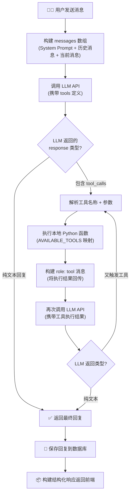
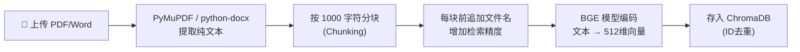
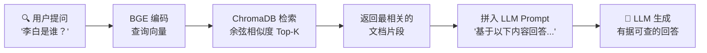
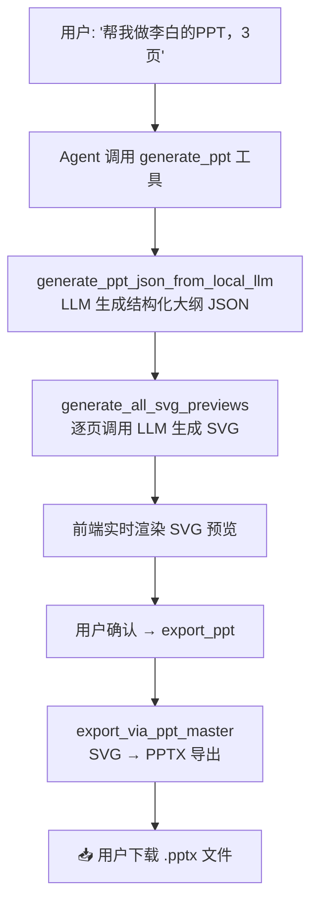
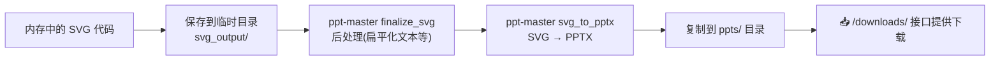

# AI 互动式教学智能体 — 项目技术说明文档

> 本文档旨在帮助你深入理解项目的架构设计、核心技术原理和工程实现细节，以便应对老师在答辩或检查时的提问。

---

## 一、项目概述

### 1.1 这个项目是什么？

**AI 互动式教学智能体** 是一个面向教师群体的智能备课辅助系统。用户（教师/学生）通过自然语言与 AI 对话，即可完成**课件 PPT 的自动生成、迭代修改、实时预览与一键导出**，同时支持**从上传的教材文档中检索知识点**（RAG 能力）来辅助教学问答。

### 1.2 核心功能一览

| 功能 | 说明 |
|------|------|
| 🤖 **智能对话** | 以「教师助手」角色，理解用户自然语言意图，自动决策是否调用工具 |
| 📝 **PPT 自动生成** | 根据主题和页数，LLM 生成结构化大纲 JSON，再逐页生成高质量 SVG 预览 |
| ✏️ **PPT 迭代修改** | 增加/删除/修改/调序页面，含智能兜底合并机制 |
| 🎨 **多风格主题** | 古典水墨、现代文学、复古手稿、竹林书院四种视觉主题 |
| 📥 **PPTX 导出** | 通过 PPT Master 专业管线导出 .pptx 文件供下载 |
| 📚 **RAG 知识检索** | 上传 PDF/Word 教材，分块存入向量数据库，按语义检索相关知识点 |
| 💬 **多会话管理** | 支持创建、切换、删除多个独立对话，聊天记录与 PPT 数据持久化 |

### 1.3 技术栈总览

```
┌─────────────────────────────────────────────────────┐
│                    前端 (Frontend)                    │
│  HTML + CSS + Vanilla JS  ·  单文件 SPA              │
│  三栏布局: 会话侧边栏 | 聊天区 | PPT 预览区           │
└─────────────────────┬───────────────────────────────┘
                      │ HTTP / REST API
┌─────────────────────▼───────────────────────────────┐
│                  后端 (Backend Python)                │
│  FastAPI (Web 框架) + Uvicorn (ASGI 服务器)           │
│                                                      │
│  ┌──────────┐  ┌───────────┐  ┌──────────────────┐  │
│  │ LLM API  │  │ RAG 知识库 │  │ PPT Master 引擎  │  │
│  │(DeepSeek)│  │(BGE+Chroma)│  │(SVG→PPTX 管线)   │  │
│  └──────────┘  └───────────┘  └──────────────────┘  │
│                                                      │
│  ┌──────────────┐  ┌────────────────┐               │
│  │ 会话数据库    │  │ 图像生成 API    │               │
│  │  (SQLite)    │  │  (通义万相)     │               │
│  └──────────────┘  └────────────────┘               │
└─────────────────────────────────────────────────────┘
```

---

## 二、系统架构详解

### 2.1 目录结构

```
PythonProjectest/
├── backend_python/             # 后端 Python 代码
│   ├── api_server.py           # FastAPI 路由入口（HTTP API 服务）
│   ├── llm_api.py              # Agent 主循环 + LLM 调用 + 工具执行
│   ├── tools_config.py         # Function Calling 工具定义（JSON Schema）
│   ├── knowledge_base.py       # RAG 知识库模块（BGE 编码 + ChromaDB 存储）
│   ├── session_db.py           # 会话持久化（SQLite CRUD）
│   ├── ppt_master_bridge.py    # PPT Master 桥接层（LLM SVG 生成 + PPTX 导出）
│   ├── ppt_engine_v2.py        # 备用 PPT 导出引擎（python-pptx）
│   ├── image_api.py            # AI 配图生成（通义万相 API）
│   └── chat_history.db         # SQLite 数据库文件
├── frontend_web/
│   └── index.html              # 前端单页应用（47KB，含全部 HTML/CSS/JS）
├── models--BAAI--bge-small-zh-v1.5/  # 本地 BGE 向量模型权重
├── ppt-master-main/            # PPT Master 第三方引擎（SVG 后处理 + 导出）
├── ppts/                       # 生成的 PPTX 文件输出目录
├── requirements.txt            # Python 依赖清单
└── .env                        # 环境变量配置（API Key 等）
```

### 2.2 前后端分离架构

本项目采用经典的**前后端分离**架构：

- **前端**：纯静态 HTML 文件，通过 `fetch()` 调用后端 REST API
- **后端**：FastAPI 提供 RESTful API，处理所有业务逻辑
- **通信协议**：HTTP JSON（前端 POST/GET 请求 → 后端 JSON 响应）

> [!NOTE]
> 前端是一个完整的**单页应用 (SPA)**，所有 HTML、CSS、JavaScript 都写在一个 `index.html` 文件中（约 1200 行），使用原生 JS 操作 DOM，**没有使用 React/Vue 等框架**。

### 2.3 后端 API 路由一览

| 方法 | 路径 | 功能 | 对应文件 |
|------|------|------|----------|
| `POST` | `/chat` | 核心聊天接口，Agent 闭环处理 | `api_server.py` → `llm_api.py` |
| `GET` | `/sessions` | 获取所有会话列表 | `session_db.py` |
| `POST` | `/sessions` | 创建新会话 | `session_db.py` |
| `DELETE` | `/sessions/{id}` | 删除会话 | `session_db.py` |
| `GET` | `/sessions/{id}/messages` | 获取会话历史消息 | `session_db.py` |
| `GET` | `/sessions/{id}/slides` | 获取会话的 PPT 数据 | `session_db.py` |
| `POST` | `/upload_reference` | 上传参考资料(PDF/Word) | `api_server.py` + `knowledge_base.py` |
| `POST` | `/kb/init` | 初始化知识库 | `knowledge_base.py` |
| `GET` | `/downloads/{file}` | 下载生成的 PPT 文件 | `api_server.py` |
| `GET` | `/health` | 健康检查 | `api_server.py` |

---

## 三、Agent 双向闭环流程（核心重点）⭐

> [!IMPORTANT]
> 这是项目最核心的技术点，也是老师最可能提问的部分。请务必理解透彻。

### 3.1 什么是 Agent？

在本项目中，**Agent** 不是简单的「接收问题 → 返回答案」的问答系统。它是一个具备**自主决策能力**的智能体——能够根据用户输入的语义，**自动判断**是否需要调用外部工具（如生成 PPT、查询知识库），并在工具执行完毕后，**将结果反馈给 LLM** 生成最终的自然语言回复。

这就是所谓的 **"Agent 双向闭环"**：

```
用户输入 → LLM 理解意图 → 决定是否调用工具
                              ├─ 不调用：直接返回文字回复
                              └─ 调用工具：
                                   执行本地函数 → 获取结果
                                   → 结果作为 tool 消息回传给 LLM
                                   → LLM 生成最终自然语言总结
```

### 3.2 OpenAI Function Calling 标准

本项目的 Agent 实现严格遵循 **OpenAI Function Calling** 规范。关键概念：

#### （1）工具定义（Tool Definition）

在 [tools_config.py](file:///d:/PythonProject/PythonProjectest/backend_python/tools_config.py) 中，用 **JSON Schema** 格式定义了 4 个工具：

| 工具名 | 功能 | 触发条件 |
|--------|------|----------|
| `generate_ppt` | 从零生成 PPT 课件 | 用户第一次要求做 PPT |
| `modify_ppt` | 在已有课件上修改 | 用户对已有课件提出调整 |
| `export_ppt` | 导出 PPTX 文件 | 用户确认导出 |
| `search_textbook` | 从知识库检索知识点 | 用户询问学术问题 |

每个工具定义包含：
- `name`：工具名称（LLM 通过名称决定调用哪个）
- `description`：工具功能描述（**LLM 根据这段文字理解何时该调用**）
- `parameters`：参数的 JSON Schema（定义参数名、类型、是否必填）

```json
{
    "type": "function",
    "function": {
        "name": "generate_ppt",
        "description": "当用户明确要求生成PPT时调用...",
        "parameters": {
            "type": "object",
            "properties": {
                "topic": { "type": "string", "description": "PPT主题" },
                "pages": { "type": "integer", "description": "页数，默认3" }
            },
            "required": ["topic"]
        }
    }
}
```

#### （2）System Prompt（系统提示词）

在 [llm_api.py](file:///d:/PythonProject/PythonProjectest/backend_python/llm_api.py#L680-L702) 中定义了 Agent 的角色设定：

```python
AGENT_SYSTEM_PROMPT = """你是一个AI教学助手老师。你可以使用以下工具来帮助学生：
- generate_ppt: 从零开始生成全新的PPT课件
- modify_ppt: 在已有课件基础上修改内容
- export_ppt: 导出最终PPT文件
- search_textbook: 从教材知识库检索权威知识点

=== 最高优先级：角色约束 ===
❗ 你是「老师/助手」，永远以教师身份向学生汇报和说明。
...
"""
```

> [!TIP]
> System Prompt 中的角色约束非常重要。没有这些约束，LLM 可能会「角色混淆」——模仿学生的语气说话。这是项目开发过程中遇到的真实 Bug。

#### （3）Agent 主循环流程

[chat_with_agent()](file:///d:/PythonProject/PythonProjectest/backend_python/llm_api.py#L705-L850) 函数是 Agent 的核心入口，整体流程如下：



**关键代码解析**（简化版）：

```python
def chat_with_agent(user_message, session_id=None, max_rounds=3):
    # 1. 构建消息列表
    messages = [{"role": "system", "content": AGENT_SYSTEM_PROMPT}]
    messages.extend(get_history(session_id, limit=20))  # 历史记忆
    messages.append({"role": "user", "content": user_message})

    # 2. Agent 循环（最多 max_rounds 轮）
    for round_num in range(max_rounds):
        # 2.1 调用带工具的 LLM API
        response = client.chat.completions.create(
            model=MODEL_NAME,
            messages=messages,
            tools=TEACHING_TOOLS,    # 传入工具定义
            tool_choice="auto"       # 让模型自主决定
        )

        assistant_message = response.choices[0].message

        # 2.2 判断：模型是否决定调用工具？
        if assistant_message.tool_calls:
            # 有工具调用 → 执行本地函数
            for tool_call in assistant_message.tool_calls:
                func_name = tool_call.function.name      # 例如 "generate_ppt"
                func_args = json.loads(tool_call.function.arguments)
                
                # 通过映射表执行对应的 Python 函数
                result = AVAILABLE_TOOLS[func_name](**func_args)

                # 将结果作为 tool 角色消息追加
                messages.append({
                    "role": "tool",
                    "tool_call_id": tool_call.id,
                    "content": str(result)
                })
            # continue → 进入下一轮，让 LLM 根据工具结果生成回复
        else:
            # 无工具调用 → 直接返回文字回复
            return assistant_message.content
```

#### （4）AVAILABLE_TOOLS 映射表

```python
AVAILABLE_TOOLS = {
    "generate_ppt": _tool_generate_ppt,    # 生成课件
    "modify_ppt":   _tool_modify_ppt,      # 修改课件
    "export_ppt":   _tool_export_ppt,      # 导出文件
    "search_textbook": _tool_search_textbook  # 知识检索
}
```

LLM 返回的 `function.name` 作为 key，直接查表找到对应的 Python 函数执行。

### 3.3 一个完整的交互示例

以用户输入 **"帮我做一个关于李白的PPT，3页"** 为例：

```
第1轮：
  用户消息 → LLM → 返回 tool_calls: [{name: "generate_ppt", args: {topic: "李白", pages: 3}}]
  
  → 执行 _tool_generate_ppt("李白", 3)
      → 调用 LLM 生成课件大纲 JSON（3页结构化数据）
      → 调用 LLM 逐页生成 SVG 预览图（3 次 LLM 调用）
      → 保存到内存 + 数据库
      → 返回结果文本："✅ 已成功生成「李白」的课件大纲！共 3 页..."

  → 将工具执行结果作为 tool 消息追加到 messages

第2轮：
  LLM 收到工具结果 → 生成自然语言总结：
  "老师已经帮你生成了关于李白的课件，共3页，请在右侧查看预览..."

  → 返回给前端显示
```

> [!NOTE]
> 整个过程中 LLM 被调用了多次：第1次是 Agent 决策调用哪个工具；中间是工具内部调用 LLM 生成内容（大纲 JSON + SVG）；最后一次是 Agent 根据工具结果生成总结。

---

## 四、RAG 知识库系统详解 ⭐

### 4.1 什么是 RAG？

**RAG (Retrieval-Augmented Generation)** = 检索增强生成。核心思想：

> 在让 LLM 回答问题之前，先从外部知识库中**检索**出与问题相关的文档片段，将这些片段作为**上下文**注入到 LLM 的 prompt 中，从而让 LLM 基于**真实的、权威的资料**来回答，而非仅凭训练数据"编造"答案。

```
传统方式：  用户问题 → LLM → 回答（可能产生幻觉）
RAG 方式：  用户问题 → 向量检索知识库 → 取出相关片段 → 拼入 prompt → LLM → 回答（有据可查）
```

### 4.2 本项目的 RAG 实现

由 [knowledge_base.py](file:///d:/PythonProject/PythonProjectest/backend_python/knowledge_base.py) 实现，核心组件：

| 组件 | 具体实现 | 作用 |
|------|----------|------|
| **Embedding 模型** | `BAAI/bge-small-zh-v1.5` (SentenceTransformer) | 将文本转换为 512 维向量 |
| **向量数据库** | ChromaDB (PersistentClient) | 存储和检索向量 |
| **相似度度量** | 余弦相似度 (cosine) | 衡量查询与文档的语义相似程度 |

#### 4.2.1 BGE 向量模型

- **全称**：BAAI General Embedding（北京智源研究院通用嵌入模型）
- **版本**：`bge-small-zh-v1.5`（中文小型版，约 24M 参数）
- **功能**：将任意中文文本映射为一个 512 维的浮点数向量
- **原理**：基于 BERT 架构微调，使得语义相近的文本在向量空间中距离接近
- **本地部署**：模型权重存放在项目根目录的 `models--BAAI--bge-small-zh-v1.5/` 文件夹中，通过 `SentenceTransformer` 库加载，**无需联网**

```python
# 加载模型（懒加载，首次使用时初始化）
_embedding_model = SentenceTransformer(BGE_MODEL_PATH, cache_folder=MODELS_DIR)

# 文本 → 向量
embedding = _embedding_model.encode(["李白是唐代浪漫主义诗人"])
# 返回: numpy array, shape = (1, 512)
```

#### 4.2.2 ChromaDB 向量数据库

- **类型**：嵌入式向量数据库（类似 SQLite，但专为向量检索设计）
- **存储方式**：`PersistentClient`，数据持久化在 `backend_python/chroma_db/` 目录
- **索引算法**：HNSW (Hierarchical Navigable Small World)，一种高效的近似最近邻搜索算法
- **相似度**：配置为 `cosine`（余弦相似度）

#### 4.2.3 知识入库流程



**关键代码**（`api_server.py` 上传接口 + `knowledge_base.py` 入库）：

```python
# 1. 文档解析（api_server.py /upload_reference 接口）
if filename.endswith(".pdf"):
    pdf_document = fitz.open(stream=content, filetype="pdf")
    for page in pdf_document:
        extracted_text += page.get_text()
elif filename.endswith(".docx"):
    doc = docx.Document(io.BytesIO(content))
    extracted_text = "\n".join([p.text for p in doc.paragraphs])

# 2. 分块（Chunking）
chunk_size = 1000
chunks = [extracted_text[i:i+chunk_size] for i in range(0, len(extracted_text), chunk_size)]
chunks = [f"参考文件《{filename}》内容片段:\n{c}" for c in chunks]

# 3. 知识入库（knowledge_base.py add_to_kb）
def add_to_kb(text_list):
    embeddings = model.encode(text_list).tolist()  # 向量化
    collection.add(ids=ids, documents=text_list, embeddings=embeddings)  # 存入 ChromaDB
```

#### 4.2.4 知识检索流程



```python
def query_kb(query_text, n_results=1):
    query_embedding = model.encode([query_text]).tolist()   # 查询向量化
    results = collection.query(
        query_embeddings=query_embedding,
        n_results=n_results          # 返回最相关的 N 条
    )
    return results["documents"]      # 返回原始文本片段
```

#### 4.2.5 RAG 在 Agent 中的触发

当 Agent 检测到用户在问知识性问题时，LLM 自动决定调用 `search_textbook` 工具：

```python
def _tool_search_textbook(query):
    results = query_kb(query, n_results=2)  # 检索 top-2 片段
    if not results:
        return "在教材知识库中未找到相关知识点。"
    combined = "\n\n".join([f"[知识库片段 {i+1}] {r}" for i, r in enumerate(results)])
    return f"从教材知识库中检索到以下关于「{query}」的权威内容：\n{combined}\n\n请基于以上内容为学生解答问题。"
```

> LLM 收到这段检索结果后，会**基于检索到的真实内容**生成回答，而不是凭空编造。

---

## 五、PPT 生成管线详解

### 5.1 整体流程概览



### 5.2 阶段一：LLM 生成结构化大纲 JSON

使用 **Few-Shot Prompting**（少样本提示）技术，让 LLM 按固定格式输出 JSON：

```python
messages = [
    {"role": "system", "content": PROMPT_CONTEXT},     # 设计师角色 + 输出格式规范
    {"role": "user", "content": EXAMPLE_INPUT},         # 示例输入
    {"role": "assistant", "content": EXAMPLE_ANSWER},   # 示例输出（JSON 格式）
    {"role": "user", "content": "请为以下主题生成课件大纲，共3页：李白"}  # 真实请求
]
```

输出结构：
```json
{
    "color_scheme": "classic_shanshui",
    "slides": [
        {
            "topic": "诗仙李白",
            "key_points": ["字太白，号青莲居士", "唐代浪漫主义诗人代表"],
            "layout": "cover",
            "icon_name": "star"
        },
        {
            "topic": "李白的生平",
            "key_points": ["701年出生于碎叶城", "25岁仗剑去国，辞亲远游"],
            "layout": "content",
            "icon_name": "book-open"
        }
    ]
}
```

### 5.3 阶段二：LLM 生成 SVG 预览图

这是项目的一大亮点——**不用模板，直接让 LLM 生成完整的 SVG 代码**：

在 [ppt_master_bridge.py](file:///d:/PythonProject/PythonProjectest/backend_python/ppt_master_bridge.py#L525-L598) 中，通过精心设计的 System Prompt（400 多行），告诉 LLM：
- 画布规格（1280×720, 16:9）
- 配色体系（HEX 色值表）
- 字体体系（KaiTi, SimSun 等）
- 设计元素指南（卡片、装饰线、阴影效果等）
- **SVG 禁止使用的特性**（确保可以转 PPTX）

四种风格对应四套详细的配色 + 设计提示词：

| color_scheme | 风格名 | 主色调 |
|-------------|--------|--------|
| `classic_shanshui` | 古典水墨 | 宣纸米 #F5F0E8 + 朱砂红 #8B1A1A |
| `modern_literary` | 现代文学 | 极简灰白 #F8F9FA + 深海蓝 #1E3A5F |
| `vintage_journal` | 复古手稿 | 牛皮纸 #E3D9C6 + 咖啡墨 #4E342E |
| `bamboo_study` | 竹林书院 | 淡青竹 #F1F8E9 + 苍翠绿 #33691E |

### 5.4 阶段三：PPTX 导出



如果 PPT Master 引擎不可用，会自动回退到备用的 `ppt_engine_v2.py`（基于 python-pptx 库直接组装 PPTX）。

---

## 六、会话持久化系统

### 6.1 SQLite 数据库设计

[session_db.py](file:///d:/PythonProject/PythonProjectest/backend_python/session_db.py) 实现了基于 SQLite 的轻量级持久化：

```sql
-- 会话表
CREATE TABLE sessions (
    session_id    TEXT PRIMARY KEY,      -- UUID 主键
    title         TEXT DEFAULT '新对话',  -- 会话标题（取自第一条消息）
    created_at    TIMESTAMP,
    updated_at    TIMESTAMP,
    slides_data   TEXT DEFAULT NULL       -- PPT JSON 数据（TEXT 存 JSON 字符串）
);

-- 消息表
CREATE TABLE messages (
    id            INTEGER PRIMARY KEY AUTOINCREMENT,
    session_id    TEXT NOT NULL,          -- 外键关联 sessions
    role          TEXT NOT NULL,          -- 'user' 或 'assistant'
    content       TEXT,
    created_at    TIMESTAMP,
    FOREIGN KEY (session_id) REFERENCES sessions(session_id) ON DELETE CASCADE
);
```

### 6.2 状态同步机制

Agent 在内存中维护一个全局状态：

```python
_agent_state = {
    "current_slides": None,        # 当前 PPT 数据
    "ppt_file_path": None,         # 导出的文件路径
    "current_session_id": None     # 当前会话 ID
}
```

每次生成或修改 PPT 时，数据会**双写**：
1. 写入内存 `_agent_state`（用于当前请求的快速访问）
2. 写入数据库 `sessions.slides_data`（用于持久化和会话恢复）

切换会话时，会从数据库**回拉**数据到内存：
```python
if session_id and not _agent_state.get("current_slides"):
    db_data = get_slides_data(session_id)
    if db_data:
        _agent_state["current_slides"] = db_data
```

---

## 七、PPT 迭代修改的智能兜底机制

### 7.1 为什么需要兜底？

LLM 在修改 PPT 时并不总是可靠的。常见问题：
- 用户说"增加一页"，LLM 可能**丢掉**原有页面
- 用户说"删除第2页"，LLM 可能**删了其他页**
- LLM 返回的 JSON 格式可能**不正确**

### 7.2 兜底策略

在 [_tool_modify_ppt()](file:///d:/PythonProject/PythonProjectest/backend_python/llm_api.py#L488-L620) 中实现了多层防御：

```
               用户修改请求
                    │
           ┌────────▼────────┐
           │  意图检测引擎     │  ← _detect_user_intent()
           │  (关键词匹配)     │     识别: add/delete/modify/reorder
           └────────┬────────┘
                    │
         ┌──────────┼──────────┐
         │          │          │
    delete/reorder  add      modify
         │          │          │
    代码直接执行   LLM 修改   LLM 修改
    (跳过 LLM)    + 兜底合并  + 兜底合并
         │          │          │
         └──────────┼──────────┘
                    │
           ┌────────▼────────┐
           │ _safe_merge_slides │  ← 智能合并
           │ 确保页数正确、     │
           │ 内容不丢失         │
           └─────────────────┘
```

**关键设计**：
- **删除/调序**操作完全**绕过 LLM**，用纯代码执行（极速 + 100% 可靠）
- **增加/修改**操作先让 LLM 尝试，再用 `_safe_merge_slides()` 做兜底合并
- 解析用户语言中的页码（支持中文数字如"第三页"和阿拉伯数字"第3页"）

---

## 八、前端技术要点

### 8.1 三栏布局

```
┌──────────┬─────────────────┬──────────────────┐
│ 会话侧边栏 │    聊天对话区     │    PPT 预览区     │
│  (240px)  │   (flex: 1)     │    (48%)         │
│           │                 │                  │
│ - 新建对话 │ - 消息气泡列表   │ - SVG 实时预览    │
│ - 会话列表 │ - 打字指示器     │ - 大纲折叠卡片    │
│ - 删除会话 │ - 文件上传      │ - 导出/刷新/JSON  │
└──────────┴─────────────────┴──────────────────┘
```

### 8.2 SVG 实时预览

前端直接将后端返回的 SVG 代码字符串注入到 DOM 中：

```javascript
slideCard.innerHTML = `
    <div class="slide-svg-container">
        ${slide.preview_svg}   <!-- 直接插入 SVG 源码 -->
    </div>
`;
```

由于 SVG 是基于 XML 的矢量图格式，浏览器可以原生渲染，无需额外的图片文件。

### 8.3 异步通信

前端使用 `fetch()` API 与后端通信：

```javascript
async function sendMessage() {
    const response = await fetch(`${API_BASE}/chat`, {
        method: "POST",
        headers: {"Content-Type": "application/json"},
        body: JSON.stringify({
            message: userInput.value,
            session_id: currentSessionId
        })
    });
    const data = await response.json();
    // data.reply → 显示聊天回复
    // data.slides_data → 更新右侧预览
}
```

---

## 九、核心专业知识 Q&A（面试/答辩准备）

### Q1: Agent 和普通的 ChatBot 有什么区别？

**ChatBot** 只是简单的问答：`输入 → LLM → 输出`。

**Agent** 具备**自主决策**和**工具使用**能力：
- 它能理解用户意图，决定是否需要调用外部工具
- 它能执行代码、查询数据库、调用 API 等操作
- 执行完工具后，它能根据结果生成总结，形成**闭环**

本项目中，LLM 自主决定调用 `generate_ppt`、`modify_ppt`、`search_textbook` 等工具，这就是 Agent 的核心特征。

### Q2: Function Calling 的原理是什么？

Function Calling 是 OpenAI 提出的一种让 LLM "使用工具"的标准协议：

1. 开发者在 API 请求中附带**工具定义**（JSON Schema 格式）
2. LLM 理解用户意图后，如果认为需要调用工具，会返回一个特殊的 `tool_calls` 字段，包含工具名和参数
3. 开发者在本地执行对应的函数，然后将结果以 `role: "tool"` 消息回传
4. LLM 根据工具结果生成最终回复

**注意**：LLM 自身并不执行代码，它只是"决定调用哪个工具、传什么参数"。真正的执行发生在我们的 Python 代码中。

### Q3: 为什么选择 ChromaDB 而不是 FAISS？

| 特性 | ChromaDB | FAISS |
|------|----------|-------|
| 易用性 | Python API 极简，3 行代码入门 | 需要手动管理索引 |
| 持久化 | 内置 PersistentClient | 需要手动 save/load |
| 元数据 | 支持存储文档原文 + 元数据 | 只存向量，需自行维护映射 |
| 生产就绪 | 适合中小规模（10万级以内） | 适合大规模（百万级以上） |
| 安装 | `pip install chromadb` | 依赖系统库，安装较复杂 |

本项目是教学场景，知识库规模不大，**ChromaDB 的易用性和开箱即用特性**更适合。

### Q4: Embedding 向量是什么？为什么可以用于语义检索？

**Embedding** 是将文本映射到高维向量空间的过程。BGE 模型将每段文本编码为 512 个浮点数组成的向量。

**核心原理**：语义相似的文本，其向量在空间中的距离（余弦相似度）更近。例如：
- "李白是唐代诗人" 和 "诗仙李白" → 余弦相似度高（~0.85）
- "李白是唐代诗人" 和 "牛顿第二定律" → 余弦相似度低（~0.15）

**余弦相似度公式**：
```
cos(A, B) = (A · B) / (||A|| × ||B||)
```
值域 [-1, 1]，越接近 1 表示越相似。

### Q5: 为什么 SVG 的限制规则那么多？

因为最终要将 SVG 转换为 PPTX 格式。PPTX 内部使用的是 **Office Open XML (DrawingML)** 格式，它不支持 SVG 的所有特性。例如：

- `clipPath`、`mask` → DrawingML 没有对应概念
- `<style>` 标签、`class` 属性 → PPTX 不支持 CSS
- `rgba()` 颜色 → 改为 `fill-opacity` + HEX 色值
- `<animate>` → PPTX 不支持 SVG 动画

如果 LLM 生成了这些禁止特性的 SVG，导出 PPTX 时就会出错或丢失效果。

### Q6: Few-Shot Prompting 是什么？

**Few-Shot Prompting（少样本提示）** 是一种 Prompt Engineering 技术，通过在提示中提供**示例输入-输出对**，让 LLM 学习期望的输出格式。

本项目中用于生成 PPT JSON：
```python
messages = [
    {"role": "system", "content": "你是PPT设计师..."},
    {"role": "user", "content": "示例输入：AI在医疗的应用"},          # 示例输入
    {"role": "assistant", "content": '{"slides": [...]}'},          # 示例输出
    {"role": "user", "content": "请为李白生成3页课件"}                # 真实请求
]
```

LLM 会模仿示例的格式和风格来处理真实请求，大幅提升输出的格式准确性。

### Q7: 这个项目有什么亮点？

1. **完整的 Agent 闭环**：不是简单的 API 调用，而是实现了工具决策 → 执行 → 反馈 → 总结的完整循环
2. **LLM 直接生成 SVG**：跳过模板引擎，LLM 直接产出可渲染的矢量图，灵活度极高
3. **智能兜底机制**：针对 LLM 不可靠的特点，代码级兜底确保操作正确性
4. **本地 RAG 知识库**：BGE 模型本地部署，无需联网即可进行语义检索
5. **多风格主题系统**：通过切换 System Prompt 实现不同视觉风格
6. **完整的工程化**：会话管理、状态持久化、错误处理、数据库迁移等

### Q8: 项目用到了哪些设计模式？

| 模式 | 在项目中的体现 |
|------|--------------|
| **策略模式** | `STYLE_PROMPT_MAP` 根据 `color_scheme` 选择不同的 SVG 生成策略 |
| **观察者模式** | 前端的事件驱动（`onclick`、`onchange`）|
| **工厂模式** | `AVAILABLE_TOOLS` 映射表根据工具名创建执行对象 |
| **门面模式** | `api_server.py` 作为统一入口，屏蔽内部复杂实现 |
| **懒加载** | BGE 模型和 ChromaDB 集合的延迟初始化 (`_get_embedding_model`) |

---

## 十、技术栈速查表

| 类别 | 技术/库 | 版本 | 用途 |
|------|---------|------|------|
| Web 框架 | FastAPI | - | REST API 服务 |
| ASGI 服务器 | Uvicorn | - | 运行 FastAPI |
| LLM API | OpenAI SDK | - | 调用 DeepSeek API |
| 向量模型 | sentence-transformers (BGE) | v1.5 | 文本向量化 |
| 向量数据库 | ChromaDB | - | 存储和检索向量 |
| PPT 生成 | python-pptx | - | PPTX 文件操作 |
| 图像处理 | Pillow | - | 图片处理 |
| PDF 解析 | PyMuPDF (fitz) | - | 提取 PDF 文字 |
| Word 解析 | python-docx | - | 提取 Word 文字 |
| 图像生成 | DashScope (通义万相) | - | AI 配图生成 |
| 数据库 | SQLite3 | 内置 | 会话和消息持久化 |
| 前端 | HTML + CSS + Vanilla JS | - | 单页应用 |

---

> [!TIP]
> **应对答辩建议**：
> 1. 重点准备 Agent 闭环流程和 RAG 原理，这两个是最常被问到的
> 2. 能画出系统架构图和流程图会大大加分
> 3. 理解 Function Calling 的本质是"LLM 决策 + 本地执行"
> 4. 了解项目中遇到的工程问题及解决方案（如 LLM 幻觉、JSON 解析失败、角色混淆等）


---

## 十一、项目代码规模统计

> 统计时间：2026年4月16日 | 统计口径：排除 `.gitignore` 中标注的文件（缓存、临时文件、未使用的旧代码等）

### 11.1 总览

项目总计约 **11,688 行** 代码（含文档），覆盖 **41 个源文件**。

### 11.2 按模块详细统计

| 模块 | 关键文件 | 行数 | 占比 |
|------|----------|-----:|-----:|
| 🧠 **核心 Agent 引擎** | `llm_api.py`, `tools_config.py` | 1,142 | 9.8% |
| 🌐 **API 服务层** | `api_server.py` | 339 | 2.9% |
| 🎨 **PPT 生成引擎** | `ppt_master_bridge.py`, `ppt_engine_v2.py` | 1,536 | 13.1% |
| 🔄 **SVG→PPTX 转换器** | `svg_to_pptx/` (11个文件) | 3,638 | 31.1% |
| 🖼️ **图像生成模块** | `image_gen.py`, `image_api.py`, `image_backends/` (12个文件) | 2,708 | 23.2% |
| 📚 **RAG 知识库** | `knowledge_base.py` | 130 | 1.1% |
| 💾 **会话持久化** | `session_db.py` | 271 | 2.3% |
| 📝 **Word 教案引擎** | `word_engine.py` | 264 | 2.3% |
| 🎮 **HTML5 互动引擎** | `html5_engine.py` | 107 | 0.9% |
| 🖥️ **前端 SPA** | `index.html` | 932 | 8.0% |
| 📄 **文档 + 配置** | `project_documentation.md`, `requirements.txt` | 624 | 5.3% |
| | **合计** | **11,688** | **100%** |

### 11.3 核心业务代码 vs 工具库代码

| 分类 | 说明 | 行数 |
|------|------|-----:|
| **核心业务代码** | 自主编写的 Agent、API、PPT引擎、知识库、会话管理、教案引擎、HTML5引擎、前端 | ~5,300 |
| **工具库代码** | 从 ppt-master 引入的 SVG→PPTX 转换器、多后端图像生成模块 | ~6,400 |

> [!NOTE]
> `svg_to_pptx/` 和 `image_backends/` 目录下的代码来源于 ppt-master 开源项目，已集成到本项目中作为 PPT 导出和 AI 配图的基础设施。核心业务逻辑（Agent 闭环、RAG、前端交互等）均为自主开发。
